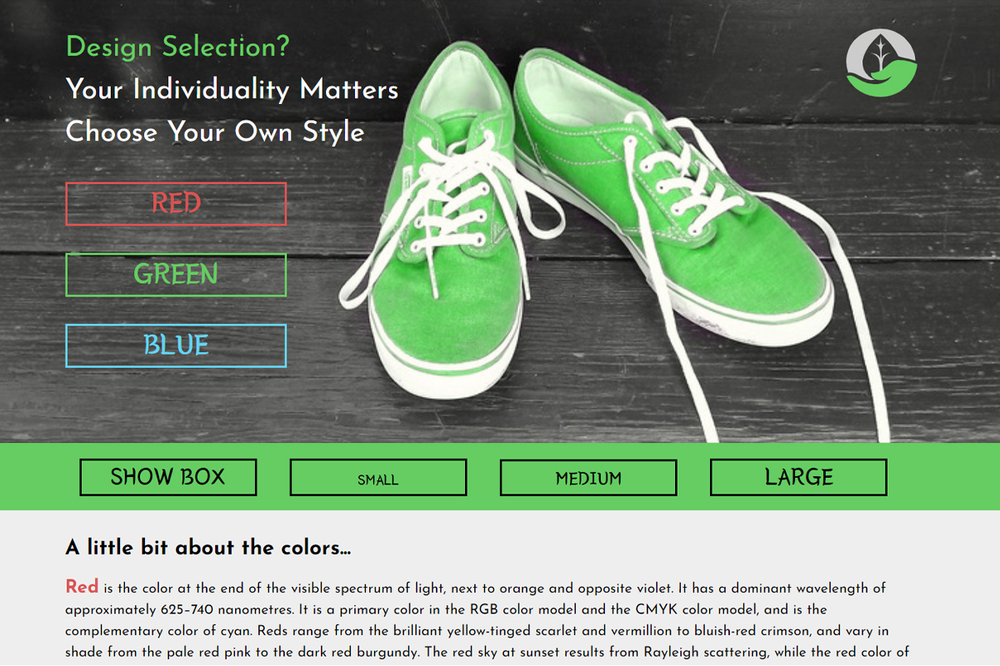

# jQuery Tricks

[Link to Demo](http://portfolio.alexandrpasko.com)

The project is a single interactive web page where a user can choose a design that fits him best. jQuery code implemented on the page allows a user to choose a main color and a font size. The chosen color makes the web page individual, which includes a custom background image made in photoshop in multiple colors. Design of the page was created according CRAP design principles. 

## Technologies/Languages:
* HTML
* CSS
* JavaScript
* jQuery
* Photoshop

## Screenshot:
